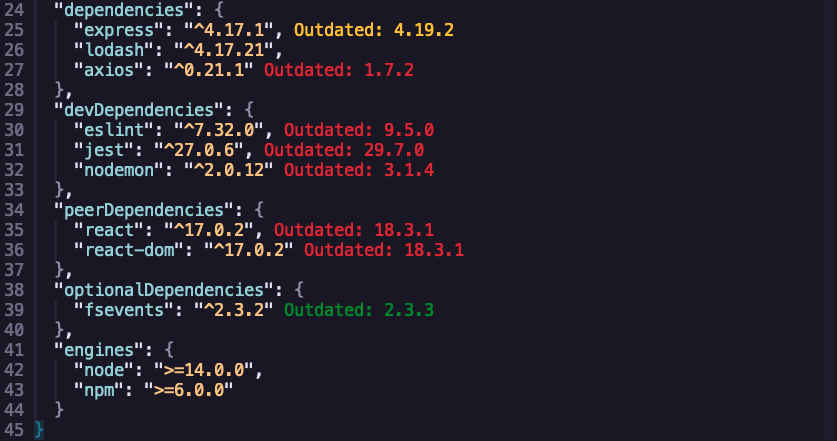
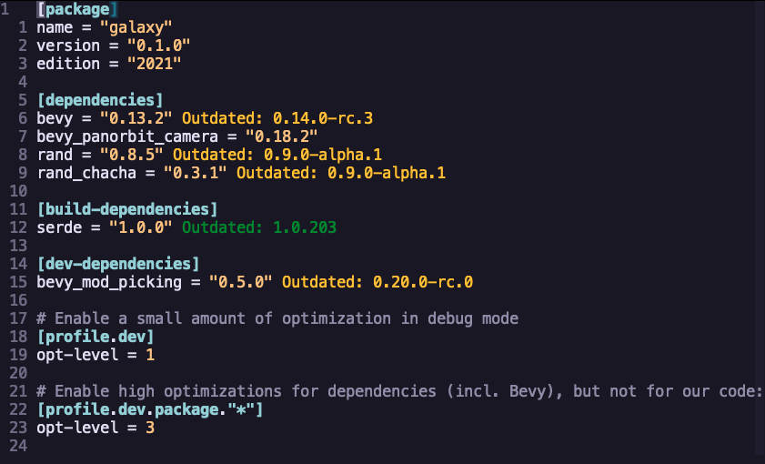

# DepSync

A simple plugin to sync dependencies in a dependency files and display the differences inline in the open buffer.

## Features

- Display differences inline in the editor
- Update dependencies in dependency file

## Preview





## Requirements

- [Npm](https://www.npmjs.com/) - For package.json support
- [Cargo](https://github.com/rust-lang/cargo) - For Cargo.toml support

## Installation

This plugin has been tested with [lazy.nvim](https://github.com/folke/lazy.nvim)

```lua
{
    'robertazzopardi/depsync',
    config = function()
      require('depsync').setup()
    end
},
```

## Usage

- `:DepSync` - Sync dependencies and show diffs in buffer
- `:DepSyncUpdate` - Update all dependencies
- `:DepSyncUpdate {dependency}` - Update a specific dependency

## Contribution

All contribution is welcome! I'll be adding support for different package managers as I need them but feel free to open an issue or PR if you need support for a specific package manager.

