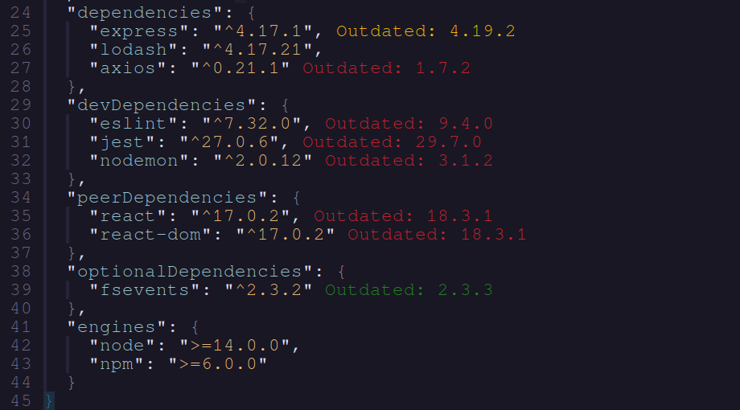

# DepSync

A simple plugin to sync dependencies in a package.json file with the npm and display the differences inline in the editor.

## Features

- Display differences inline in the editor



- Update dependencies in package.json

## Requirements

- [Npm](https://www.npmjs.com/) - Node Package Manager

## Installation

This plugin has been tested with [lazy.nvim](https://github.com/folke/lazy.nvim)

```lua
{
    'robertazzopardi/depsync',
    config = function()
      require('depsync').setup()
    end
},
```

## Usage

- `:DepSync` - Sync dependencies in package.json with npm
- `:DepSyncUpdate` - Update dependencies in package.json

## Contribution

All contribution is welcome!

